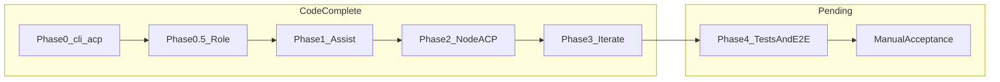
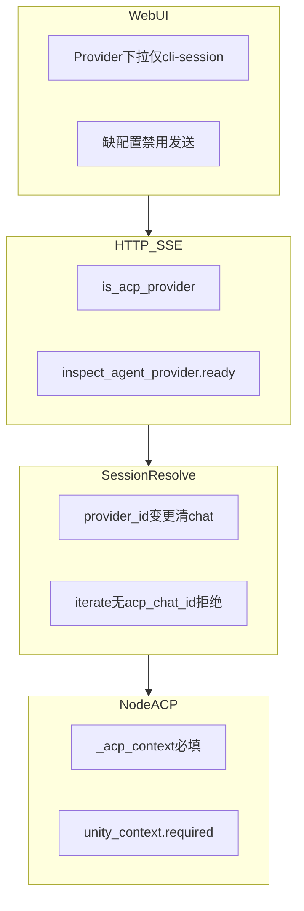

# 工作流 Agent ACP 集成计划书

版本：v1.3  
状态：执行中（代码已落地，边界 P0 已完成，待验收）  
日期：2026-06-29  
测试基线：`74+ passed`（含 `test_assist_workspace`；`unittest discover -s tests`）  
关联：`workflow-assist-mvp.md`、`workflow-execution-core-plan.md`、`wayland-cursor-agent-fix.md`、`cursor-cli-api-auth-wayland.md`

---

## 0. 执行摘要

将 AIWF 中 **所有 CLI Provider**（Cursor Agent、Codex CLI）统一为 **ACP + Session** 模式，彻底移除批处理路径（`agent --print`、`codex exec` 一次性 prompt）。

**已确认的产品决策（v1.1）：**

| 决策 | 选择 |
|------|------|
| 助手 Session 生命周期 | **跟随工作流 ID**：切换 `editingWorkflow.id` 时自动新建/切换 session |
| CLI 方案 | **仅保留 ACP**；删除 `cursor-agent-cli`（print）、`codex-cli`（exec batch）及一切 fallback |
| Role Agent 生成 | **只能走 ACP + Session**（L0）；禁止 API、禁止 print |
| Provider 接口 | **CLI 废弃 `generate()` / `stream_provider_generate()`**；只暴露 Session 接口 |
| 运行期 Session 粒度 | **Node 级**：`run_id + node_id` 一个 `acp_chat_id`；L2 首次执行 create-chat，L3 iterate **resume 同一 chat** |
| Codex CLI | **与 Cursor 同等对待**：`codex-agent-acp` + SessionRegistry，不走 exec batch |
| 结果来源 | **以 workspace 文件为准**，不再从 stdout 解析 JSON |
| API Provider | OpenAI / Anthropic **保留一次性 HTTP**（非 CLI，不走 ACP Session） |

**最终目标：** Agent 在本地 workspace 里持续会话式执行——改编排、生成 Role、跑节点、优化产物——证据落盘在 `.aiwf/`，人工闸门（应用/Review/保存）不变。

### 0.1 进度总览（v1.3）

| Phase | 代码 | 单测 | 手工验收 |
|-------|------|------|----------|
| 0 ACP 基础 | 完成 | 部分（4 项 fixture） | 待做 |
| 0.5 L0 Role | 完成 | mock 覆盖 | 待做 |
| 1 L1 助手 | 完成 | normalize 为主，缺 ACP mock | 待做 |
| 2 L2 节点 + Unity 扩展 | 完成 | **缺口** | 待做 |
| 3 L3 iterate | 完成 | Mock executor 路径，**缺 ACP resume** | 待做 |
| 4 验收收尾 | 未开始 | — | — |
| **4.8 边界检测 P0** | **完成** | **2 项 session 守卫 + doctor** | 待做 |



**验收标记说明：** `[x]` 代码或自动化已覆盖；`[~]` 单测或局部验证；`[ ]` 待手工 E2E 或 Phase 4 补齐。

---

## 1. North Star（交付定义）

完成本计划 **Phase 0～3** 后，系统应满足：

1. **双 CLI 路径、同一 Session 模型**：Provider 层只有 `cursor-agent-acp` 与 `codex-agent-acp`，共享 `CliAcpClient` + `SessionRegistry`；无 print / exec batch 分支。
2. **CLI 只有 Session 接口**：`acquire_session(scope)` → `send_message(text)` → 读 workspace 文件；删除 `Provider.generate()`、`stream_cli_prompt`、`stream_provider_generate` 对 CLI 的实现。
3. **L0 Role 生成**：`agent_id → role assist session`；多轮改 `.aiwf/agents/assist/<session>/role.json`；**禁止** API / print。
4. **L1 编排助手**：`workflow_id → assist session`；多轮短消息改 `draft.json`；预览 → 应用 → 撤销仍有效。
5. **L2/L3 运行期（Node 级）**：每个 `run_id + node_id` 绑定唯一 `acp_chat_id`；Turn1（节点执行）create-chat + 写 artifact；Turn2+（iterate）**resume 同一 chat** + 短 feedback；产出 `ExecutionResult` + Changelist（最小集）。
6. **跨平台**：Windows Cursor 通过 PowerShell → `cursor-agent.ps1` spawn；Codex 默认 `codex app-server`（`AIWF_CODEX_ACP_CMD` 可覆盖）。
7. **无 CLI 时**：UI 提示安装 / 切换 Provider；**不回退 print 或 exec batch**；可选用 API Provider（仅非 Role、非强制 CLI 场景）。

---

## 2. 基线与迁移状态

### 2.1 已实现模块

| 模块 | 路径 | 状态 |
|------|------|------|
| ACP 客户端 | `src/aiwf/cli_acp.py` | 已实现 |
| 助手 UI | `web/js/workflow/assist.js` | 已实现（`session_id`、按 workflow 切换） |
| 助手业务 | `src/aiwf/workflow_assist.py` + `assist_workspace.py` | 已实现（ACP 主路径 + 本地改名） |
| Role 生成 | `src/aiwf/agents.py` + `agent_assist_workspace.py` | 已实现（L0 ACP；待 E2E） |
| Provider | `src/aiwf/agent_providers.py` | 已实现（双 ACP；CLI generate 已删） |
| Node Session | `src/aiwf/session.py` | 已实现（`acp_chat_id`） |
| Node ACP | `src/aiwf/node_acp.py` + `executor.py` | 已实现（待 ACP 单测） |
| Unity 上下文 | `src/aiwf/unity_aibridge.py` | 已实现（Phase 2 扩展） |
| 执行结果 | `src/aiwf/execution_result.py` + `runner.py` | 已实现（`node_results` 写入） |
| 执行结果计划 | `docs/workflow-execution-core-plan.md` | 交叉引用待 Phase 4.7 更新 |

### 2.2 已删除路径（v1.2 确认，历史对照）

**Cursor print：**

```text
agent --trust --print --output-format text "<mega prompt>"
  → extract_json_object(stdout)
  → done / error
```

**Codex exec batch：**

```text
codex exec --sandbox workspace-write "<mega prompt>"
  → read -o tempfile / stdout
  → done / error
```

**共用批处理抽象（CLI 用途全删）：**

```text
Provider.generate(prompt)                       # CLI 实现已移除
stream_provider_generate(provider_id, prompt)   # 仅 API 分支保留
stream_cli_prompt / run_cli_prompt / run_codex_prompt
CursorAgentCliProvider / CodexCliProvider
```

### 2.3 CLI 调用点迁移清单（v1.2 状态）

| # | 调用点 | 目标 | 状态 | 实现位置 |
|---|--------|------|------|----------|
| 1 | `workflow_assist.stream_workflow_assist` | **L1** ACP session | 已完成 | `workflow_assist.py` → `stream_workflow_assist_acp` |
| 2 | `agents.stream_agent_generate` | **L0** ACP session | 已完成 | `agents.py` → `stream_role_assist_message` |
| 3 | `executor.AgentExecutor.run` | **L2** node 级 ACP | 已完成 | `executor.py` + `node_acp.py` |
| 4 | `runner.iterate_node` | **L3** resume `acp_chat_id` | 已完成 | `runner.py` → `build_node_acp_context` |
| 5 | `agent_providers.stream_provider_generate` | 删除 CLI 分支 | 已完成 | `agent_providers.py`（仅 API） |
| 6 | `create_agent_provider` → CLI `.generate()` | `create_cli_session_provider()` | 已完成 | `agent_providers.py` |
| 7 | `test_agent_provider` | ACP `create-chat` ping | 已完成 | `agent_providers.py` |
| 8 | `examples/agents/*.json` | `*-agent-acp` | 已完成 | `examples/agents/*.json` |

**保留（非 CLI Session）：**

- `openai-api` / `anthropic-api` / `openai-compatible-api`：一次性 HTTP `generate()`（Mock executor 不变）
- Role Agent 生成：**不在此列**——必须走 CLI ACP Session

---

## 3. 目标架构

### 3.1 分层

```text
Web UI
  → HTTP/SSE (role-generate / assist / run / iterate)
    → Session Managers (L0/L1/L2/L3)
      → SessionRegistry（chat_id → CliAcpClient 长连接）
        → CliAcpClient（唯一 CLI 入口，Cursor / Codex 共用协议层）
          → cursor: agent acp [--workspace] [--trust]
          → codex:  codex app-server（实验性；AIWF_CODEX_ACP_CMD 可覆盖；未来 native acp 再对齐）
            → stdio ACP 协议
```

### 3.2 四层 Session（L2/L3 合并为 Node 级）

| 层级 | Scope Key（SessionRegistry） | 存储 | Workspace | 核心文件 |
|------|------------------------------|------|-----------|----------|
| **L0 Role** | `role:{agent_id}` | `.aiwf/agents/assist/index.json` + `<session_id>/` | `.aiwf/agents/assist/<session_id>/` | `role.json`, `context.md`, `summary.md`, `session.json` |
| **L1 Authoring** | `workflow:{workflow_id}` | `.aiwf/assist/index.json` + `<session_id>/` | `.aiwf/assist/<session_id>/` | `draft.json`, `context.md`, `summary.md`, `session.json` |
| **L2 Run（Node Turn1）** | `{run_id}:{node_id}` | `node_sessions/<node_id>/` | run `workspace_root` | `session.json`（含 `acp_chat_id`）, artifact |
| **L3 Iterate（Node Turn2+）** | 同 L2 | 同 L2 | 同 L2 | **resume** 同一 `acp_chat_id`；追加 turns |

**Node 级 Session 规则（L2/L3 写死）：**

- **不存在** run 级共享 chat；每个节点独立 `acp_chat_id`。
- L2 节点**首次执行**（Turn1）：`create-chat` → 写 bootstrap（task.md / output path）→ `send_message` → Agent 写 artifact → 持久化 `acp_chat_id` 到 `node_sessions/<node_id>/session.json`。
- L3 **iterate**：加载同一 `acp_chat_id` → `SessionRegistry.resume` → 短 feedback + artifact 路径 → 读更新 artifact → 追加 `SessionTurn`。
- 同一 node 在同一 run 内 Turn1～TurnN **始终同一 chat**；`rerun_from` 新 run → 新 node session / 新 chat。

### 3.3 Session 跟随工作流（L1 规则）

```text
assist_index.json:
{
  "by_workflow_id": {
    "workflow_123456": { "session_id": "assist_abc", "chat_id": "...", "updated_at": "..." }
  },
  "active_workflow_id": "workflow_123456"
}
```

**行为：**

- 用户打开/切换到工作流 A → 加载或创建 A 的 session；若无则 `create-chat` + 写 bootstrap 文件。
- 切换到工作流 B → **自动切换/新建** B 的 session；**不**复用 A 的 chat。
- 同一 workflow 再次打开 → resume 已有 `chat_id`。
- 用户「新建工作流」新 ID → 新 session。
- Clone 工作流（新 ID）→ 新 session；可选复制 draft 文件，**不**复制 chat_id。

### 3.4 Session 跟随 Role Agent（L0 规则）

```text
agents_assist_index.json:
{
  "by_agent_id": {
    "requirement_analyst": { "session_id": "role_assist_xyz", "chat_id": "...", "updated_at": "..." }
  }
}
```

- 编辑某 Role Agent → 绑定该 `agent_id` 的 session；切换 Role → 切换 session。
- 新建 Role（新 `agent_id`）→ 新 session。
- 结果读 `role.json` + `summary.md`；**禁止** stdout JSON 解析、**禁止** API Provider。

---

## 4. 范围边界

### 4.1 In Scope

- [x] `cli_acp.py`（`CliAcpClient` + `SessionRegistry` + 协议层）
- [x] `cursor-agent-acp` / `codex-agent-acp` 双 Provider
- [x] **废弃 CLI `generate()`**，统一 Session 接口（§5.4）
- [x] Windows spawn（PowerShell → `cursor-agent.ps1`）
- [x] L0 Role Agent 生成全面 ACP 化
- [x] L1 工作流助手全面 ACP 化
- [x] L2/L3 Node 级 ACP + `acp_chat_id` resume
- [x] 删除 print / exec batch provider 与相关 env
- [x] `assist.js` / `agents.js` session 管理
- [x] **Phase 2 扩展：Unity AIBridge 节点上下文**（`unity_aibridge.py`、`Setup-AIBridge.ps1`、`unity_activity_create.json` `unity_context`）
- [~] **Phase 2 扩展：工作台四列布局**（`shell-layout.js`）— UI 增强，非 ACP 阻塞
- [ ] 集成测 + 手工验收 + zombie 进程验证（Phase 4）
- [~] 单测 + 文档更新（架构/MVP 已更新；execution-core 交叉引用待补）

### 4.2 Out of Scope（本计划不做）

- Skill 编辑器改造
- Role Agent **编辑器 UI** 大改（后端调用链必须在 scope 内）
- 助手 / Role **自动保存**到磁盘（仍手动保存）
- MCP / Harness 集成（另开专项，非本文 Phase 4 验收）
- DAG 画布、分布式执行
- 拖拽节点到助手区
- print / exec batch fallback（**明确删除**）
- Role Agent 走 API Provider（**明确禁止**）

### 4.3 保留不变的交互

- 助手：预览 → **应用** → 撤销（内存）；工具栏 **保存** 落盘
- Role：生成 → 预览 → 应用 → 保存（与助手同模式）
- Run：Review 闸门、Revision、Change 模型
- Example 工作流只读 → clone 后编辑

### 4.4 边界检测与守卫（v1.3）



| 层级 | 触发点 | 规则 | 错误/行为 | P0 |
|------|--------|------|-----------|-----|
| **UI-L0** | `agents.js` 生成 Provider | 仅 `kind === "cli-session"` | 下拉不出现 API | [x] |
| **UI-L1** | `assist.js` 助手 Provider | 同上 | 同上 | [x] |
| **API** | `stream_agent_generate` / `stream_workflow_assist` | `is_acp_provider` + `inspect.ready` | `ValueError` | [x] |
| **L0 Session** | `resolve_role_session` | 旧 `provider_id` ≠ 请求 → 清 `chat_id` + `release_scope(role:…)` | 下轮 create-chat | [x] |
| **L1 Session** | `resolve_workflow_session` | 同上，`workflow:…` scope | 同上 | [x] |
| **L2** | `AgentExecutor` + ACP provider | 无 `_acp_context` | `RuntimeError` | [x] |
| **L3** | `runner.iterate_node` / `node_acp` | iterate 无 `acp_chat_id` | `ValueError`「先执行 Turn1」 | [x] |
| **Unity** | `maybe_collect_unity_context` | `required: true` 且 CLI 不可用 | `RuntimeError` | [x] |
| **Doctor** | `check_acp_providers` | 双 ACP inspect；均未配置 → skip | pass + skip 文案 | [x] |

**P1 延后（§16.8）：** `SessionRegistry.acquire` provider 不一致强制重建；`server` shutdown → `SessionRegistry.close_all()`；zombie 进程手工验收。

---

## 5. CliAcpClient 规格（Phase 0 核心）

### 5.1 新文件

`ai-workflow-foundation/src/aiwf/cli_acp.py`

**职责：**

| 能力 | 说明 |
|------|------|
| `resolve_spawn_argv(provider_id, workspace)` | Cursor: PowerShell + `cursor-agent.ps1 acp`；Codex: `codex app-server`（`AIWF_CODEX_ACP_CMD` 可覆盖） |
| `SessionRegistry.acquire(scope_key, workspace, *, chat_id=None)` | 按 scope 缓存长连接；workflow/agent 切换或 server 退出时 `close()` |
| `CliAcpClient.start_session(...)` | spawn + ACP 握手 |
| `CliAcpClient.send_message(text) -> Iterator[events]` | 用户消息；yield log/progress/assistant/done |
| `CliAcpClient.create_chat() -> str` | 包装 `agent create-chat` / codex 等价命令 |
| `CliAcpClient.close()` | 结束 subprocess |

**SessionRegistry 规则：**

- 内存 map：`scope_key → CliAcpClient`（`role:{agent_id}` | `workflow:{workflow_id}` | `{run_id}:{node_id}`）。
- 同一 scope 串行：`send_message` 加锁，避免并发写同一 chat。
- TTL：scope 切换时 close 旧 client；server shutdown hook 全部 cleanup。
- 进程模型：**长连接**（对齐 Wayland）；禁止每轮 spawn 新进程（除非 resume 失败需重建）。

**环境变量：**

| 变量 | 默认 | 说明 |
|------|------|------|
| `AIWF_CURSOR_ACP_CMD` | （平台解析） | Cursor spawn 覆盖 |
| `AIWF_CODEX_ACP_CMD` | （平台解析） | Codex spawn 覆盖 |
| `AIWF_CLI_ACP_TIMEOUT` | `600` | 单轮超时秒（Cursor/Codex 共用） |
| `AIWF_CURSOR_WORKSPACE` | 项目根 | Cursor 默认 workspace |
| `AIWF_CODEX_WORKSPACE` | 项目根 | Codex 默认 workspace |
| `CURSOR_API_KEY` | — | Cursor 认证 |
| Codex 认证 env | — | 以 Codex 文档为准 |

**删除/废弃：**

- `AIWF_CURSOR_AGENT_CMD`（print 默认值）
- `AIWF_CODEX_CLI_CMD`（exec batch 默认值）
- Provider id `cursor-agent-cli` → `cursor-agent-acp`
- Provider id `codex-cli` → `codex-agent-acp`

### 5.2 Provider 注册

`agent_providers.py`：

```text
AGENT_PROVIDER_SPECS:
  - id: cursor-agent-acp
    kind: cli-session          # 新 kind，区别于 api
    requires: AIWF_CURSOR_ACP_CMD|agent + CURSOR_API_KEY|agent login
  - id: codex-agent-acp
    kind: cli-session
    requires: AIWF_CODEX_ACP_CMD|codex + <codex auth env>

保留（kind: api，仍用 generate）:
  - openai-api / anthropic-api / openai-compatible-api

删除:
  - cursor-agent-cli
  - codex-cli
  - stream_cli_prompt / run_cli_prompt / run_codex_prompt（CLI 用途）
```

### 5.3 ACP 协议实现策略

1. **P0**：Cursor 实测 `agent acp`；Codex 实测 `codex app-server`；记录 stdin/stdout JSON 行格式。
2. 共用解析层；spawn argv 按 provider 分叉。
3. 实现最小消息集：`initialize` / `session` / `prompt` / `chunk` / `done` / `error`（以实测为准命名）。
4. 单测用 **录制的 fixture 行** mock stdio，不依赖 live CLI。
5. 集成测：`@unittest.skipUnless(shutil.which("agent"))` / `codex`（Phase 4.5 待补）。

**协议实测状态（0.6）：**

| Provider | docstring / 单测 | 集成测 |
|----------|------------------|--------|
| Cursor `agent acp` | 已写入 `cli_acp.py` 模块 docstring | 待 Phase 4.5 |
| Codex `app-server` | spawn 已对齐；协议细节待补 docstring | 待 Phase 4.5 |

参考 spawn 修复：`docs/wayland-cursor-agent-fix.md` §4～§5。

### 5.4 统一 Session 接口（废弃 CLI generate）

**删除（CLI）：**

```python
class AgentProvider(Protocol):
    def generate(self, prompt: str) -> str: ...   # CLI 实现全部移除

stream_provider_generate(provider_id, prompt)      # CLI 分支删除
```

**新增：**

```python
@dataclass(frozen=True)
class AcpSessionScope:
    provider_id: str          # cursor-agent-acp | codex-agent-acp
    scope_key: str            # agent_id | workflow_id | f"{run_id}:{node_id}"
    workspace: Path
    chat_id: str | None = None

class CliSessionProvider(Protocol):
    spec: AgentProviderSpec

    def acquire_session(self, scope: AcpSessionScope) -> CliAcpClient: ...
    def send_message(self, client: CliAcpClient, text: str) -> Iterator[dict]: ...
    def create_chat(self, client: CliAcpClient) -> str: ...
```

**调用方改造：**

| 模块 | 旧 | 新 |
|------|----|----|
| `workflow_assist.py` | `stream_provider_generate` | `acquire_session(L1 scope)` + `send_message` + 读 `draft.json` |
| `agents.py` | `stream_provider_generate` | `acquire_session(L0 scope)` + `send_message` + 读 `role.json` |
| `executor.py` | `provider.generate(prompt)` | node scope Turn1：`create_chat` + `send_message` + 读 artifact |
| `runner.iterate_node` | mega prompt | resume node `acp_chat_id` + 短 feedback |

API Provider 继续使用 `generate()`；`AgentExecutor` 在 provider 为 `kind=api` 时仍可走 HTTP（**Role 生成除外**——Role 强制 `cli-session`）。

---

## 6. L0 Role Agent 生成（Phase 0.5）

### 6.1 新文件

`ai-workflow-foundation/src/aiwf/agent_assist_workspace.py`

```text
.aiwf/agents/assist/
  index.json
  role_assist_<uuid>/
    session.json             # chat_id, agent_id, provider_id
    context.md               # Role 模板、ident/soul 规则、输出 schema
    role.json                # Agent 可读写
    summary.md
```

### 6.2 `agents.py` 改造

**删除：**

- `stream_provider_generate` 调用链
- `build_generate_agent_prompt` 巨型 prompt（缩为 bootstrap `context.md`）
- stdout `extract_json_object` 主路径

**保留：**

- `normalize_generated_agent` / `validate_agent_data`

**新流程：**

```text
stream_agent_generate(..., agent_id from draft):
  1. provider 必须为 cursor-agent-acp 或 codex-agent-acp（否则报错）
  2. resolve session by agent_id (index.json)
  3. sync UI draft → role.json
  4. if new session: create-chat → context.md bootstrap
  5. ACP send_message(short user text)
  6. read role.json + summary.md → normalize → yield done
```

### 6.3 API / 前端

- `POST /agents/generate/stream`：新增 `agent_id`、`session_id`；SSE 事件 `{ "type": "session", ... }`
- `web/js/settings/agents.js`：Provider 下拉**仅** `cursor-agent-acp` / `codex-agent-acp`；默认 acp；`agentSessionByAgentId` Map
- `messages` 数组：废弃后端发送（同 L1）

### 6.4 Phase 0.5 验收

- [ ] Role 多轮：改 ident → 改 soul 不重发 full role JSON（待真机 E2E）
- [ ] 切换 Role A/B 会话隔离（待真机 E2E）
- [x] 无 API Provider 可选路径（Role 生成 UI）
- [x] 结果来自 `role.json`，非 stdout（代码路径）
- [~] L0 workspace + mock ACP（`test_generate_agent_draft_mocked`）

---

## 7. L1 工作流助手（Phase 1）

### 7.1 新文件

`ai-workflow-foundation/src/aiwf/assist_workspace.py`

```text
.aiwf/assist/
  index.json
  assist_<uuid>/
    session.json
    context.md
    draft.json
    summary.md
```

### 7.2 `workflow_assist.py` 改造

**删除：**

- `build_workflow_assist_prompt` 巨型 prompt（或缩为 bootstrap `context.md`）
- `stream_provider_generate` + JSON repair 重试链

**保留：**

- `_try_simple_workflow_edit`（本地改名，不调 CLI）
- `normalize_generated_workflow` / `validate_workflow_data`
- `_normalize_assist_result`

**新流程：** 同 v1.0 §6.2，改用 §5.4 Session 接口。

### 7.3 API / 前端

同 v1.0 §6.3～6.4；Provider 下拉：`cursor-agent-acp` + `codex-agent-acp`（无 API）。

### 7.4 Phase 1 验收

- [ ] 同一 workflow 多轮不重发 full draft（待真机 ACP）
- [ ] 切换 workflow A/B 会话隔离（待真机 ACP）
- [ ] Windows spawn 无 ENOENT/EINVAL（待本机验证）
- [ ] 预览/应用/撤销正常（UI 回归）
- [x] grep：`cursor-agent-cli` / `codex-cli` / `--print` / `codex exec` / `stream_cli_prompt` → 0（`agent_providers` 别名映射除外）
- [x] 默认 provider `cursor-agent-acp`
- [x] `workflow-assist-mvp.md` v0.2

---

## 8. L2 节点执行（Phase 2）

### 8.1 ExecutionResult 最小集

新/扩：`src/aiwf/execution_result.py`

Runner 写入：`.aiwf/runs/<run_id>/node_results/<node_id>.json`

### 8.2 AgentExecutor（Node Turn1）

```text
run(node, skill, inputs, run_id):
  workspace = resolve_workspace(node, workflow)
  scope_key = f"{run_id}:{node.id}"
  session = NodeSessionStore.get_or_create(run_dir, node.id)
  if not session.acp_chat_id:
      client = SessionRegistry.acquire(scope, workspace)
      chat_id = client.create_chat()
      write bootstrap: task.md（skill、input paths、output path）
      session.acp_chat_id = chat_id  # 落盘
  else:
      client = SessionRegistry.resume(session.acp_chat_id)
  send_message(short task)
  read artifact → ExecutionResult
```

**删除：** `provider.generate(prompt)`（CLI 路径）。

### 8.3 Phase 2 验收

- [x] `runner.write_node_result` → `node_results/*.json`（代码路径）
- [x] `node_acp` Turn1 写 `node_sessions/.../session.json` 含 `acp_chat_id`（代码路径）
- [ ] 节点测试产生 `node_results/*.json` + `acp_chat_id`（待 ACP mock 单测 / E2E）
- [ ] 同一 node 第二次执行（同 run）resume 而非 new chat（待 ACP E2E）
- [x] Mock executor 不受影响（`test_runner` / `test_session` 仍通过）

### 8.4 Unity AIBridge 扩展（v1.2 并入 Phase 2）

| 组件 | 职责 |
|------|------|
| `unity_aibridge.py` | 解析 `node.params.unity_context`；调用 AIBridgeCLI；写入 `unity_context/` manifest |
| `node_acp._write_task_bootstrap` | Turn1 将 Unity 上下文路径注入 `task.md` |
| `doctor.check_aibridge_integration` | `AIWF_UNITY_PROJECT_ROOT` 未设则 skip |
| `Setup-AIBridge.ps1` | 本地 CLI 安装引导 |

**验收：**

- [ ] `unity_activity_create` Module Mapping 节点 Turn1 生成 `unity_context/`（配置 AIBridge 时）
- [ ] `required: true` 且 CLI 不可用时节点失败语义明确
- [x] `test_unity_aibridge.py` 7 项单测通过

---

## 9. L3 节点迭代（Phase 3）

### 9.1 session.py 扩展

`NodeSession` 增加（Turn1 即写入）：

```json
{
  "acp_chat_id": "chat-uuid",
  "acp_provider_id": "cursor-agent-acp"
}
```

### 9.2 iterate 流程（Node resume）

```text
iterate(run_id, node_id, feedback):
  load NodeSession（必须有 acp_chat_id，否则报错「先执行 Turn1」）
  client = SessionRegistry.resume(acp_chat_id)
  send_message(short feedback + primary artifact path)
  read updated artifact
  append SessionTurn + ExecutionResult
```

**禁止：** 重放完整上轮 artifact 的 mega prompt。

### 9.3 Phase 3 验收

- [x] `runner.iterate_node` + `node_acp` iterate 分支（代码路径）
- [x] `node-iterate.js` Turn / commit / revert UI
- [~] `test_session.py` iterate/commit/revert（MockAI executor，非 ACP resume）
- [ ] Turn1 执行 → Turn2 feedback 补全 → commit → Review（待 ACP E2E）
- [ ] Turn2 使用 resume，日志可见同一 `chat_id`（待 ACP E2E）
- [ ] Cursor / Codex provider 均可 iterate（待双 Provider E2E）

---

## 10. 文件级任务清单（给执行对话勾选）

### Phase 0 — ACP 基础（阻塞项）

| # | 文件 | 动作 | 状态 |
|---|------|------|------|
| 0.1 | `src/aiwf/cli_acp.py` | **新增** CliAcpClient + SessionRegistry + 协议层 | **完成** |
| 0.2 | `src/aiwf/agent_providers.py` | 注册 `cursor-agent-acp` / `codex-agent-acp`；**删除** cli batch providers；**删除** CLI `generate()` | **完成** |
| 0.3 | `tests/test_cli_acp.py` | **新增** fixture stdio 单测（Cursor + Codex fixtures） | **部分**（无 Codex fixture 文件） |
| 0.4 | `tests/test_agents.py` | 更新 provider 别名；Session 接口 mock | **完成** |
| 0.5 | `docs/architecture.md` | Executor / Provider → ACP Session | **完成** |
| 0.6 | — | 实测 Cursor + Codex 协议，写入 `cli_acp.py` docstring | **部分**（Cursor 有；Codex spawn 有，协议细节待补） |

### Phase 0.5 — Role Agent（与 Phase 1 可并行，但依赖 Phase 0）

| # | 文件 | 动作 | 状态 |
|---|------|------|------|
| 0.5.1 | `src/aiwf/agent_assist_workspace.py` | **新增** L0 index + role.json | **完成** |
| 0.5.2 | `src/aiwf/agents.py` | ACP 主路径；**禁止** API/print | **完成** |
| 0.5.3 | `src/aiwf/server.py` | generate API 增加 `agent_id` / `session_id` | **完成** |
| 0.5.4 | `web/js/settings/agents.js` | session 随 agent 切换；Provider 仅 acp | **完成** |
| 0.5.5 | `examples/agents/*.json` | provider → `cursor-agent-acp` | **完成** |
| 0.5.6 | `tests/test_agents.py` | L0 workspace + mock ACP | **完成** |

### Phase 1 — 工作流助手

| # | 文件 | 动作 | 状态 |
|---|------|------|------|
| 1.1 | `src/aiwf/assist_workspace.py` | **新增** | **完成** |
| 1.2 | `src/aiwf/workflow_assist.py` | ACP Session 主路径 | **完成** |
| 1.3 | `src/aiwf/server.py` | assist API `session_id` / `workflow_id` | **完成** |
| 1.4 | `web/js/workflow/assist.js` | session 随 workflow 切换 | **完成** |
| 1.5 | `tests/test_workflow_assist.py` | workspace/index；mock Session | **部分**（normalize / 本地改名；缺 ACP mock） |
| 1.6 | `docs/workflow-assist-mvp.md` | 升 v0.2 | **完成** |

### Phase 2 — 节点执行（Node Turn1）

| # | 文件 | 动作 | 状态 |
|---|------|------|------|
| 2.1 | `src/aiwf/execution_result.py` | **新增或扩展** | **完成** |
| 2.2 | `src/aiwf/executor.py` | AgentExecutor → node ACP session | **完成** |
| 2.3 | `src/aiwf/session.py` | Turn1 写 `acp_chat_id` | **完成** |
| 2.4 | `src/aiwf/runner.py` | 写 node_results | **完成** |
| 2.5 | `web/js/workflow/node-test.js` | 展示 result summary | **完成** |
| 2.6 | `tests/test_runner.py` | node session + ExecutionResult | **未完成** |
| 2.7 | `src/aiwf/unity_aibridge.py` | Unity 上下文采集 | **完成** |
| 2.8 | `tests/test_unity_aibridge.py` | 单测 | **完成** |
| 2.9 | `src/aiwf/doctor.py` | aibridge check | **完成** |

### Phase 3 — 节点迭代（Node resume）

| # | 文件 | 动作 | 状态 |
|---|------|------|------|
| 3.1 | `src/aiwf/runner.py` | iterate → resume `acp_chat_id` | **完成** |
| 3.2 | `src/aiwf/server.py` | iterate API 接 Session | **完成** |
| 3.3 | `web/js/workflow/node-iterate.js` | 对接 | **完成** |
| 3.4 | `tests/test_session.py` | resume + turn 追加 | **部分**（MockAI；非 ACP resume） |

### Phase 4.8 — 边界检测

| # | 文件 | 动作 | 状态 |
|---|------|------|------|
| 4.8.1 | `assist_workspace.py` / `agent_assist_workspace.py` | provider 切换清 chat + `release_scope` | **完成** |
| 4.8.2 | `agents.js` / `assist.js` | 生成/助手 Provider 仅 cli-session | **完成** |
| 4.8.3 | `doctor.py` | `check_acp_providers` | **完成** |
| 4.8.4 | `tests/test_assist_workspace.py` | session provider 切换单测 | **完成** |
| 4.8.5 | `cli_acp.py` SessionRegistry | provider 不一致强制重建 | **未完成**（P1） |
| 4.8.6 | `server.py` | shutdown → `close_all` | **未完成**（P1） |
| 4.8.7 | §16 手工清单 | 边界 E2E 补充 | **未完成**（P1） |

### 清理项（Phase 1 结束时必做）

| # | 动作 | 状态 |
|---|------|------|
| C.1 | grep：`cursor-agent-cli` / `codex-cli` / `--print` / `codex exec` / `stream_cli_prompt` / `run_codex_prompt` → 0 | **完成**（`agent_providers` 别名映射除外） |
| C.2 | grep：`stream_provider_generate` 仅剩 API 分支 | **完成** |
| C.3 | grep：`Provider.generate` 实现仅 api kind | **完成** |
| C.4 | 更新 `Sync-DesktopApp` / 桌面 env 文档：双 ACP provider | **部分**（`Sync-DesktopApp` robocopy 已改；桌面 env 文档待补） |
| C.5 | 默认 provider：`cursor-agent-acp`（`agents.py`、`assist.js`、`agents.js`） | **完成** |

**技术债备注：**

- `build_workflow_assist_prompt` / `build_generate_agent_prompt` 仍存，仅 `test_workflow_assist.py` 引用 → 待删或迁测试 fixture
- `extract_json_object` 保留作工具函数；Role/L1 主路径已不依赖 stdout 解析

---

## 11. 测试策略

```powershell
Set-Location "G:\FF_Wang\ProjectStudy\ai-workflow-foundation\ai-workflow-foundation"
$env:PYTHONPATH="src"
py -3 -m unittest discover -s tests -q
```

**当前基线：** 72 passed, 1 skipped。

| 层级 | 内容 |
|------|------|
| 单测 | ACP stdio 解析、SessionRegistry、L0/L1 index 切换、normalize 保留用例 |
| 集成 | `@skipUnless(agent/codex)`：create-chat → 一条消息 → 读 workspace 文件（Phase 4.5 待补） |
| 手工 | Role 多轮 + 助手多轮 + 切换 workflow/agent + node Turn1/Turn2 resume |

**覆盖缺口（v1.3）：**

| 模块 | 现有 | 缺口 |
|------|------|------|
| `cli_acp` | spawn、registry、dispatch | Codex fixture NDJSON |
| L0 | `test_generate_agent_draft_mocked` | workspace index 切换 |
| L1 | normalize / 本地改名 | `stream_workflow_assist_acp` mock |
| L2/L3 | `test_session`（MockAI） | `node_acp` / ACP resume |
| Unity | 7 tests | 与 runner 集成 1 条 |
| **边界** | `test_assist_workspace` provider 切换、doctor acp | SessionRegistry provider 重建（P1） |

**全局 CLI 验收：**

- [x] 所有 CLI 调用经 `SessionRegistry` + `CliAcpClient`（代码路径）
- [x] Role 生成无 API 路径（代码路径）
- [ ] L2/L3 同一 node 同一 `acp_chat_id`（待 ACP E2E）
- [ ] Server 重启 / scope 切换无 zombie 进程（待手工验证）

---

## 12. 风险与对策

| 风险 | 对策 |
|------|------|
| ACP 协议未公开稳定 | Cursor/Codex 分别实测；共用宽松解析层 |
| Codex `app-server` 协议差异 | 独立 spawn argv；`AIWF_CODEX_ACP_CMD` 可覆盖；共享事件模型 |
| 长驻进程泄漏 | SessionRegistry 按 scope 生命周期 close；server 退出 cleanup |
| Agent 改错目录 | bootstrap 明确只允许写 scope workspace 内指定文件 |
| 无 CLI 命令 | UI 提示安装；**不恢复** print/exec；Role 必须装 CLI |
| 与 execution-core-plan 冲突 | P2 只做 ExecutionResult 最小集；Changelist UI 可简版 |

---

## 13. 执行顺序与剩余工作

```text
Phase 0～3 代码：已完成（2026-06 分支）
Phase 4 验收收尾：进行中（约 3～5 天）
```

**Phase 0 + 0.5 + 1** 已可执行 `Restart-AIWF.ps1` 做 Role + 助手端到端验证；Phase 4 完成后更新本文状态为「已完成」。

---

## 14. 给新对话的执行提示（复制即用）

```text
请按 docs/workflow-agent-acp-plan.md v1.3 执行 Phase 4 验收收尾（边界 P0 已完成）。

优先：
1. 新增 tests/test_node_acp.py（mock ACP Turn1 + iterate resume）
2. 补 test_workflow_assist ACP mock 与 test_runner node_results 断言
3. 可选 @skipUnless 集成测（agent acp / codex app-server）
4. 跑 unittest + Restart-AIWF.ps1，按 §16 手工清单验收
5. 验收通过后：计划书状态改为「已完成」，勾选 §6.4～9.3 剩余项

不要改：Review/Revision 核心、自动保存策略。
```

---

## 15. 文档变更索引

| 文档 | 变更 |
|------|------|
| `workflow-assist-mvp.md` | v0.2：ACP Session、随 workflow |
| `workflow-agent-acp-plan.md` | 本文档 v1.3：§4.4 边界守卫、Phase 4.8、scope_key 对齐 |
| `architecture.md` | CLI → ACP Session；双 provider（v1.1 已更新） |
| `workflow-execution-core-plan.md` | Node 级 acp_chat_id；iterate resume（交叉引用待 Phase 4.7） |

---

## 16. Phase 4 — 验收与收尾

> 注：本节 Phase 4 指 **ACP 验收收尾**；MCP / Harness 集成仍为 Out of Scope 另开专项。

| # | 任务 | 说明 |
|---|------|------|
| 4.1 | `tests/test_node_acp.py` | mock `stream_acp_message`：Turn1 create-chat + 写 artifact + `acp_chat_id` 落盘 |
| 4.2 | `tests/test_workflow_assist.py` | mock `stream_workflow_assist_acp`：index 切换、session 事件 |
| 4.3 | `tests/test_runner.py` | 注入 ACP mock executor：`node_results/*.json` 断言 |
| 4.4 | `tests/test_session.py` | 可选分支：`agent_provider=cursor-agent-acp` + mock `node_acp` |
| 4.5 | `tests/test_cli_acp_integration.py` | `@skipUnless(agent)` / `@skipUnless(codex)` 各 1 条 |
| 4.6 | 手工清单 | Role 多轮；助手切换 workflow；node Turn1→Turn2 同 `chat_id`；Restart 无 zombie |
| 4.7 | `workflow-execution-core-plan.md` | 补 Node `acp_chat_id` / iterate resume 交叉引用 |

**手工验收清单（4.6）：**

- [ ] Role：同一 agent 多轮改 ident / soul，session 不丢
- [ ] Role：切换 agent A/B，会话隔离
- [ ] 助手：同一 workflow 多轮，不重发 full draft
- [ ] 助手：切换 workflow A/B，会话隔离
- [ ] 节点：Turn1 执行后 `session.json` 含 `acp_chat_id`
- [ ] 节点：Turn2 iterate 日志可见同一 `chat_id`
- [ ] Restart-AIWF 后无残留 `agent` / `codex` zombie 进程

### 16.8 Phase 4.8 — 边界检测（v1.3）

> 注：P0 项已完成；P1 项见 §4.4 延后列表。

| # | 任务 | 状态 |
|---|------|------|
| 4.8.1 | `resolve_*_session` provider 切换清 chat + `release_scope` | **完成** |
| 4.8.2 | UI 生成/助手 Provider 仅 cli-session | **完成** |
| 4.8.3 | `doctor.check_acp_providers` | **完成** |
| 4.8.4 | `test_assist_workspace.py` 边界单测 | **完成** |
| 4.8.5 | SessionRegistry provider 不一致重建 | P1 |
| 4.8.6 | server shutdown cleanup | P1 |
| 4.8.7 | 边界 E2E 写入手工清单 | P1 |

---

*v1.3 变更摘要：新增 §4.4 边界守卫矩阵；Phase 4.8 P0（provider 切换、UI 仅 ACP、doctor）；scope_key 与实现对齐。*

*v1.2 变更摘要：同步代码落地进度；Unity AIBridge 并入 Phase 2；新增 Phase 4 验收；Codex 默认 `app-server`。*

*v1.1 变更摘要：Role 仅 ACP；废弃 CLI generate；Node 级 resume；Codex 同 Cursor ACP Session。*
