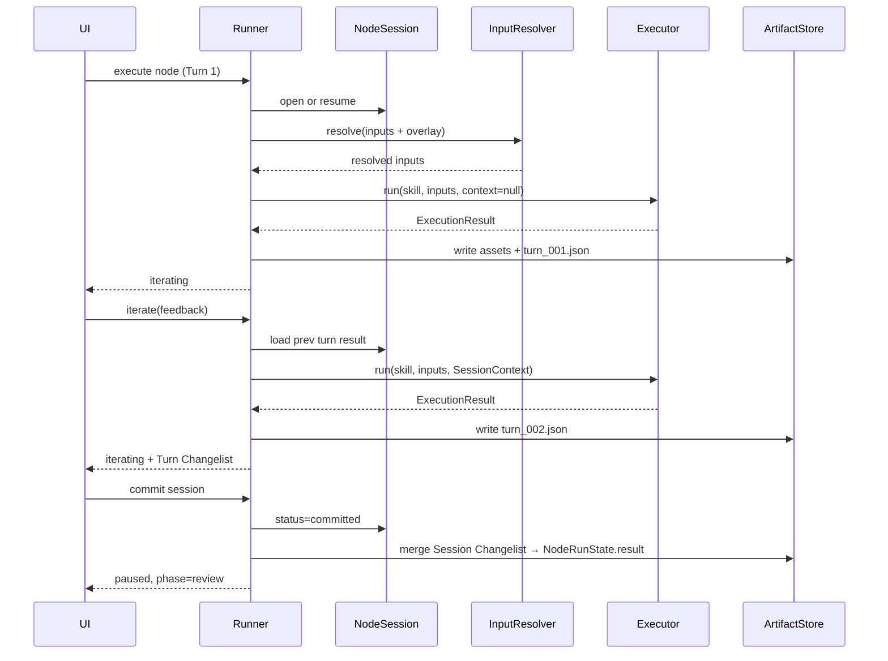
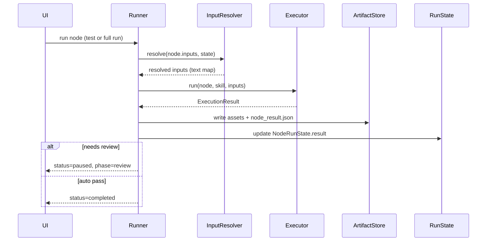

# 工作流节点执行核心模型计划书

版本：v0.2  
状态：设计草案（待 review）  
日期：2026-06-17  
关联：`ai-workflow-foundation-requirements.md`、`mvp-boundary-v0.2.md`

---

## 1. 背景与问题

当前实现已能跑通「节点顺序执行 → 写 Markdown Artifact → Review → Change → Rerun → Revision」闭环，但在**节点输入/输出**这一核心概念上存在三类问题：

### 1.1 概念混用

| 层面 | 当前 UI 表现 | 实际含义 | 用户直觉 |
|------|-------------|----------|----------|
| **Inputs JSON** | 手写 JSON | 编排期：声明执行时读哪些参数 | 流程对，但不应手写 JSON |
| **Outputs JSON** | 手写 JSON | 编排期：约定主产物文件名 | 像「执行结果」，严重误导 |
| **执行后展示** | 单个 `artifact` 路径 + 预览 | 运行期：本次操作实际产出了什么 | 缺少 Changelist / 资产清单 |

用户真正需要的是：

- **编排时**：用可视化方式声明「这个节点读什么」
- **执行后**：看到「这次操作做了什么」——摘要 + 资产列表 + 变更清单（类似 Cursor 单次 Agent 修改）

### 1.2 与产品定位的偏差

需求文档的核心循环是：

```text
配置节点 → 执行节点 → 查看产物 → 审核产物 → 对话反馈
→ 结构化修改 → 重跑节点 → 提交 Revision → 继续后续节点
```

其中「查看产物」和「结构化修改」都应以**可审查的变更集合**为中心，而不是让用户提前配置输出文件名。

### 1.3 技术债现状

| 模块 | 现状 | 缺口 |
|------|------|------|
| `node.inputs` | `literal` / `artifact.<node_id>` 解析已实现 | UI 仍为 raw JSON |
| `node.outputs` | 仅 `primary` / `structured` 文件名约定 | 与执行结果混为一谈 |
| `NodeRunState` | 单个 `artifact` 字段 | 无 summary、无 assets、无 changes |
| `changes/*.json` | Review 驳回后的 feedback 操作 | 未覆盖正常执行产出 |
| Executor 协议 | `run() -> str`（Markdown 文本） | 无结构化执行结果 |
| 节点迭代 | `feedback_history` + `rerun_from` | 无 Session、无对话上下文、不可结构化改 Skill/Input |

### 1.4 节点迭代缺口

典型任务（如 Wiki 需求拉取与整理）往往需要**多轮 refine**：首轮产出缺「协议」章节 → 用户补充反馈 → 继续优化产物，甚至升级 Skill 或补全 Input。当前仅有 Review 驳回后的粗粒度 `feedback → rerun`，缺少：

- **Session**：节点内的多轮执行上下文（Turn 历史）
- **对话上下文**：上一轮 `ExecutionResult` / artifact 注入下一轮 prompt
- **结构化修改**：通过 ChangeItem 修改 `inputs`、`skill`、`extra_prompt`，而非仅 append `feedback_history`

---

## 2. 设计目标

### 2.1 一句话

> **编排期管「读什么」，运行期管「做了什么」；所有 AI 操作最终落成可审查、可 diff、可回滚的资产变更清单。**

### 2.2 核心原则

1. **编排与运行分离**：Workflow 定义数据流；Run 记录执行证据。
2. **输入可视化绑定**：用户通过表单声明参数来源，不手写 JSON（高级模式可保留）。
3. **输出即 Changelist**：节点执行结果 = 摘要 + 资产列表 + 变更操作，而非提前配置文件名。
4. **契约可推断**：产出命名优先由 Skill 的 Output Contract 决定，节点级覆盖为高级选项。
5. **向后兼容**：现有 `inputs` / `outputs` / `artifact` 字段在迁移期继续有效。
6. **本地优先、可复盘**：所有关键结果落盘在 `.aiwf/runs/<run_id>/`，不依赖外部对话服务；Node Session 的 Turn 历史同样落盘。
7. **节点可迭代**：节点执行不是单次快照，而是可在 Review 闸门前通过多轮 Turn 持续 refine 产物、提示词或 Skill。

### 2.3 非目标（本阶段不做）

- 真实代码仓库级 patch apply（类 git apply）
- 二进制 / 图片 diff
- 分布式执行与云端队列
- 拖拽画布式编排

---

## 3. 概念模型

### 3.1 三层分离

```text
┌─────────────────────────────────────────────────────────────┐
│  Layer A · 编排期（Workflow Authoring）                       │
│  - 节点类型、Skill、审批策略                                   │
│  - InputBinding[]：参数从哪来                                  │
│  - OutputContract（可选）：Skill 级产出契约                    │
│  - IterationPolicy（可选）：节点迭代策略                         │
└─────────────────────────────────────────────────────────────┘
                              ↓ 执行
┌─────────────────────────────────────────────────────────────┐
│  Layer B · 运行期（Run Execution）                            │
│  - NodeSession：节点内多轮 Turn，累积对话与产物上下文          │
│  - InputResolver：把 Binding 解析成 Executor 可用的文本上下文   │
│  - Executor：Skill + Inputs + SessionContext → ExecutionResult│
│  - ArtifactStore：落盘 assets，生成 evidence                   │
└─────────────────────────────────────────────────────────────┘
                              ↓ 呈现
┌─────────────────────────────────────────────────────────────┐
│  Layer C · 审查期（Review & Revision）                        │
│  - NodeResultView：摘要 + Changelist + 预览                   │
│  - Review 决策：approve / reject + feedback                  │
│  - ChangeRequest：反馈 → 结构化 operations → apply → rerun    │
│  - Revision：稳定快照 + diff + rollback                       │
└─────────────────────────────────────────────────────────────┘
```

### 3.2 术语对照

| 新术语 | 含义 | 替代/关系 |
|--------|------|-----------|
| **InputBinding** | 单个输入参数的声明（名、来源、值） | 现有 `node.inputs` 的单项 |
| **InputSource** | `literal` / `artifact` / `param` / `file` | 来源类型枚举 |
| **OutputContract** | Skill 声明的预期产出类型与命名 | 现有 `skill.output` + `node.outputs` |
| **ExecutionResult** | 单次节点执行的完整结果 | 扩展 Executor 返回值 |
| **Asset** | 一条落盘产物记录 | 扩展 `NodeRunState.artifact` |
| **ChangeItem** | 一条变更操作（create/modify/delete） | 对齐 Cursor Changelist |
| **NodeResult** | 运行状态 + ExecutionResult 的 UI 视图模型 | 新 |
| **NodeSession** | 单节点在单次 Run 内的多轮迭代容器 | 新；替代粗粒度 rerun 循环 |
| **SessionTurn** | Session 内一次执行（含 feedback、result、changes） | 新 |
| **SessionContext** | 注入 Executor 的上一轮产物 + 对话摘要 | 新 |
| **IterationPolicy** | 节点级迭代策略（max_turns、允许修改的目标） | 编排期可选配置 |

### 3.3 与 Cursor 单次修改的类比

| Cursor Agent 会话 | 本系统节点执行 |
|-------------------|----------------|
| 用户 prompt（上下文） | InputBinding 解析后的 Inputs |
| Agent 执行 | Executor + Skill |
| 修改了哪些文件 | `ExecutionResult.assets[]` |
| 每个文件 create/edit/delete | `ExecutionResult.changes[]` |
| 会话摘要 | `ExecutionResult.summary` |
| Accept / Reject | Review approve / reject |
| 重新 prompt | SessionTurn（iterate）或 ChangeRequest + Rerun |
| 多轮对话历史 | `node_sessions/<id>/turns/` |
| 改 Rules / Skill | ChangeItem → `skill.quality` / skill override |
| 改上下文输入 | ChangeItem → `workflow.node.inputs` |

---

## 4. 输入模型（InputBinding）

### 4.1 编排期数据结构

底层仍可使用 `node.inputs` 对象持久化，但增加显式类型（迁移期兼容旧格式）：

```json
{
  "inputs": {
    "raw_requirement": {
      "source": "literal",
      "value": "Create a seasonal Unity big event..."
    },
    "requirement": {
      "source": "artifact",
      "ref": "requirement_analysis",
      "path": "primary"
    }
  }
}
```

**兼容规则**：若值为字符串，按 v0.2 规则解析（`artifact.<id>` 或 literal）。

### 4.2 InputSource 类型

| source | 说明 | 示例 |
|--------|------|------|
| `literal` | 固定文本 | 原始需求、配置片段 |
| `artifact` | 引用上游节点主产物 | `ref: requirement_analysis` |
| `artifact_path` | 引用上游指定产物路径 | `ref: module_mapping`, `path: structured` |
| `param` | 工作流级参数（后续） | `ref: workspace_root` |
| `file` | 工作区文件（后续） | `ref: docs/spec.md` |

v0.3 最小集：`literal` + `artifact`（覆盖现有 95% 场景）。

### 4.3 InputResolver 流程

```text
for each binding in node.inputs:
  if source == literal     → resolved[name] = value
  if source == artifact    → read upstream NodeRunState.assets[primary]
  if source == artifact_path → read upstream named asset
return resolved: dict[str, str]
```

实现上复用现有 `_resolve_inputs()`，扩展为识别结构化 binding。

### 4.4 UI：输入绑定编辑器（替代 JSON 文本框）

**表单行模型**（主编辑体验）：

```text
┌──────────────────────────────────────────────────────────┐
│ 输入绑定                                    [+ 添加参数]  │
├────────────┬──────────────┬──────────────────────────────┤
│ 参数名     │ 来源         │ 值                            │
├────────────┼──────────────┼──────────────────────────────┤
│ raw_req…   │ 固定文本 ▼   │ [多行文本框]                  │
│ require…   │ 上游产出 ▼   │ [requirement_analysis ▼]      │
└────────────┴──────────────┴──────────────────────────────┘
                                    [高级 · JSON]（折叠）
```

**交互规则**：

- 首节点默认提供 `raw_requirement` 行（literal）
- 有上游节点时，「上游产出」下拉列出所有前序节点 ID
- 参数名建议由 Skill 的 input schema 提示（后续）
- 保存时序列化为 `node.inputs`，用户无需接触 JSON

---

## 5. 输出与执行结果模型（ExecutionResult）

### 5.1 核心转变

| 旧思路 | 新思路 |
|--------|--------|
| 用户在 Outputs JSON 里写文件名 | Skill OutputContract 提供默认命名 |
| 执行后只有一个 `artifact` 路径 | 执行后生成 `ExecutionResult` |
| 概览显示「预期产出」 | 概览显示「本次变更清单」 |

### 5.2 OutputContract（编排期，可选）

由 **SkillSpec** 主导，节点可覆盖：

```json
{
  "output": {
    "primary": { "kind": "markdown", "name": "{node_id}.md" },
    "structured": { "kind": "json", "name": "{node_id}.json", "optional": true }
  }
}
```

- `{node_id}` 模板变量在运行时替换
- 节点级 `outputs` 退化为「覆盖 Skill 契约」的高级选项
- **从主编辑区移除 Outputs JSON 文本框**

### 5.3 ExecutionResult（运行期）

```json
{
  "summary": "完成需求分析，识别 4 个功能模块与 2 项风险。",
  "assets": [
    {
      "ref": "artifacts/requirement_analysis.md",
      "kind": "markdown",
      "action": "create",
      "size": 2048,
      "sha256": "..."
    },
    {
      "ref": "artifacts/requirement_analysis.json",
      "kind": "json",
      "action": "create",
      "size": 512
    }
  ],
  "changes": [
    {
      "action": "create",
      "target": "artifacts/requirement_analysis.md",
      "summary": "新增需求分析文档"
    },
    {
      "action": "create",
      "target": "artifacts/requirement_analysis.json",
      "summary": "新增结构化侧车"
    }
  ],
  "primary_ref": "artifacts/requirement_analysis.md"
}
```

### 5.4 ChangeItem 动作枚举

| action | 含义 | 典型场景 |
|--------|------|----------|
| `create` | 新建资产 | 首次执行节点 |
| `modify` | 修改已有资产 | 重跑覆盖、人工编辑后继续 |
| `delete` | 删除资产 | 精简产出（后续） |
| `rename` | 重命名 | 产物规范化（后续） |

### 5.5 NodeRunState 扩展

```json
{
  "id": "requirement_analysis",
  "status": "paused",
  "phase": "review",
  "artifact": "artifacts/requirement_analysis.md",
  "result": {
    "summary": "...",
    "assets": [...],
    "changes": [...],
    "primary_ref": "artifacts/requirement_analysis.md"
  },
  "message": "Execution finished. Waiting for review.",
  "started_at": "...",
  "finished_at": "..."
}
```

**兼容**：`artifact` 保留为 `primary_ref` 的快捷字段，供现有 API / UI 使用。

### 5.6 Executor 协议演进

```python
# 现有
def run(node, skill, inputs) -> str

# 目标
def run(node, skill, inputs) -> ExecutionResult
```

迁移策略：

1. 适配层：`str` 返回值自动包装为 `ExecutionResult`（单 asset create）
2. Mock / Agent Executor 逐步返回完整结构
3. Skill Executor 按 OutputContract 生成多 asset

---

## 6. Node Session 迭代模型

### 6.1 动机与定位

节点执行不应止于「单次 `executor.run()`」。用户需要在 Review 闸门前，像 Cursor Agent 一样**多轮对话式 refine**：

- **产物迭代**：补全遗漏章节（如 Wiki 分析缺「协议」）
- **提示词迭代**：追加 `extra_prompt` 或调整 InputBinding
- **Skill 迭代**：把反复出现的经验沉淀进 Skill（quality / SKILL.md）

Node Session 是 Layer B 的运行期子模型，与 **ExecutionResult / Changelist** 自然衔接：每一 Turn 产出一个 `ExecutionResult`，Turn 间的 diff 汇入 Session 级 Changelist。

### 6.2 三种迭代路径

| 路径 | 改什么 | 典型场景 | 影响下游 |
|------|--------|----------|----------|
| **A · 产物迭代** | 当前 run 的 artifact | 「补协议章节」 | 仅本次 run |
| **B · Input / 提示词迭代** | `node.inputs`、`node.params.extra_prompt` | Wiki 需补子页面 URL | run overlay，可选提升为工作流默认 |
| **C · Skill 迭代** | `skill.quality`、`skill.ref`（SKILL.md） | 五类 checklist 沉淀 | run 级 override，可选写回全局 Skill |

**默认走 A**；反复出现的模式走 C；数据源不全走 B。

### 6.3 与 Review / Session 的边界

```text
Session iterating (Turn 1..N)
  → 每 Turn 产出 ExecutionResult + Changelist
  → 用户点「完成迭代」或自检通过
Session committed
  → 冻结 NodeRunState.result（取最后一 Turn 或合并 Changelist）
  → status=paused, phase=review
Review approve → 下游节点继续
Review reject  → 可回到 Session 继续 iterate，或走 ChangeRequest 升级 Skill/Input
```

**原则**：Session 内迭代轻量、高频；Review 是质量闸门，不每轮都触发。

### 6.4 编排期：IterationPolicy（可选）

节点可声明迭代策略（缺省则启用 Session，max_turns=10）：

```json
{
  "params": {
    "iteration": {
      "enabled": true,
      "max_turns": 10,
      "targets": ["artifact", "inputs", "skill"],
      "auto_complete": false
    }
  }
}
```

| 字段 | 说明 |
|------|------|
| `enabled` | 是否允许多轮 iterate（false 时等同单次执行） |
| `max_turns` | 单 Session 最大轮次，防成本失控 |
| `targets` | 允许结构化修改的目标类型 |
| `auto_complete` | 是否由 AI 对照 Skill checklist 自动判定完成（Phase 4+） |

### 6.5 运行期：NodeSession 与 SessionTurn

**Session 元信息**（`node_sessions/<node_id>/session.json`）：

```json
{
  "node_id": "requirement_analysis",
  "status": "iterating",
  "turn": 2,
  "skill_ref": "unity_requirement_analysis",
  "skill_override": null,
  "inputs_overlay": {},
  "committed_at": null,
  "created_at": "2026-06-17T08:00:00Z",
  "updated_at": "2026-06-17T08:30:00Z"
}
```

| status | 含义 |
|--------|------|
| `iterating` | 可继续 iterate |
| `committed` | 已冻结，进入 Review |
| `abandoned` | 用户放弃，回退到上一 committed 或空 |

**单 Turn 记录**（`node_sessions/<node_id>/turns/turn_002.json`）：

```json
{
  "turn": 2,
  "feedback": "补充协议章节，对照 Wiki Protocol 子页",
  "change_refs": ["chg_20260617-083000-001"],
  "session_context": {
    "prev_primary_ref": "artifacts/requirement_analysis.md",
    "prev_summary": "完成需求分析，识别 4 个模块，缺协议。"
  },
  "result": {
    "summary": "补全协议章节，新增 2 个模块。",
    "assets": [...],
    "changes": [
      { "action": "modify", "target": "artifacts/requirement_analysis.md", "summary": "新增协议章节" }
    ],
    "primary_ref": "artifacts/requirement_analysis.md"
  },
  "started_at": "...",
  "finished_at": "..."
}
```

- **Turn 1**：无 `feedback`，等同首次执行；`changes` 多为 `create`
- **Turn 2+**：带 `feedback` + `session_context`；`changes` 多为 `modify`
- 每 Turn 的 `result` 即标准 **ExecutionResult**，与 §5 完全一致

### 6.6 SessionContext 与 Executor Prompt

迭代轮次在 `build_executor_prompt()` 基础上追加：

```text
## Previous Result
<summary from prev turn>
<primary artifact content or excerpt>

## User Feedback (this turn)
补充协议章节；对照 Wiki Protocol 子页

## Iteration Goal
在保留已有内容基础上增量补全，输出完整 Markdown artifact。
```

`SessionContext` 由 Runner 从上一 Turn 的 `ExecutionResult` 组装，不依赖外部 chat API。

### 6.7 结构化修改与 ChangeItem 衔接

Session 内的 Input / Skill 修改走 **ChangeItem**，与 Review 驳回、执行产出共用 schema（§5.4）：

| target | operation | 场景 |
|--------|-----------|------|
| `run.artifact` | modify | 产物增量（Turn 内或由 Executor 写回） |
| `workflow.node.inputs` | set / merge | 补 wiki URL、上游 binding |
| `workflow.node.params.extra_prompt` | set / append | 节点级提示词 |
| `workflow.node.params.feedback_history` | append | 兼容现有 rerun 路径 |
| `skill.quality` | append | 追加质量条目 |
| `skill.ref` | set | run 级 skill override 路径 |

**落盘策略**：

- 编排期 workflow 定义不变；运行时修改写入 `workflow.lock.json` 或 `session.json` 的 `inputs_overlay` / `skill_override`
- approve 后可选择「提升为工作流默认」（写回源 workflow JSON）
- Skill 全局写回 `examples/skills/` 需用户显式确认

### 6.8 Session 级 Changelist 聚合

UI 展示两层 Changelist：

| 层级 | 数据来源 | 用途 |
|------|--------|------|
| **Turn Changelist** | 单 Turn 的 `result.changes` | 本轮做了什么 |
| **Session Changelist** | 合并所有 Turn 的 changes（按 target 去重，保留最终 action） | 节点迭代总共改了什么 |

`NodeRunState.result` 在 `committed` 时取 **Session Changelist** + 最后一 Turn 的 `assets` / `summary`。

### 6.9 与现有 feedback → rerun 的兼容

现有 `create_change_request` → `apply` → `rerun_from` 视为 **Session Turn 的简化路径**：

| 现有 | 迁移后 |
|------|--------|
| `feedback_history` append | Turn N 的 `feedback` 字段 |
| `rerun_from` 全量重跑 | `POST .../iterate` 创建新 Turn |
| 无 turn 记录 | 自动创建 `turn_001.json`（从已有 artifact 合成） |

旧 run 无 `node_sessions/` 时，首次 iterate 从 `NodeRunState.result` 或 `artifact` 引导建 Session。

### 6.10 示例：Wiki 需求分析

```text
Turn 1
  Input: wiki_url (literal)
  Skill: unity_requirement_analysis
  Result: requirement_analysis.md（模块/界面/资源，缺协议、配置）
  Changelist: create requirement_analysis.md

Turn 2（产物迭代）
  Feedback: "补充协议与配置章节"
  SessionContext: Turn 1 产物
  Result: 增量补全
  Changelist: modify requirement_analysis.md

Turn 3（Input 迭代，可选）
  ChangeItem: inputs.protocol_wiki_url = "..."
  Feedback: "对照 Protocol 子页复核"
  Result: 再次 modify

Session committed → Review
  Session Changelist: 1× create + 2× modify（聚合展示）
  approve → module_mapping 节点读取 primary artifact
```

### 6.11 NodeSession 执行时序



---

## 7. 端到端执行流程

### 7.1 单节点执行时序



### 7.2 与 Review / Change / Session 的关系

```text
首次执行 / Session Turn 1
  → ExecutionResult（create assets）
Session iterate (Turn 2..N)
  → ExecutionResult（modify assets）+ Turn Changelist
Session commit
  → NodeRunState.result（Session Changelist 聚合）
  → Review
      approve → 继续下游
      reject  → 回到 Session iterate，或 ChangeRequest（modify skill/inputs）
              → apply → 新 Turn 或 Rerun
```

**关键**：Review 驳回、Session 内 Input/Skill 修改、执行产出的 `changes` 共用同一 **ChangeItem** 结构，便于 UI 统一展示。

### 7.3 落盘目录结构（目标）

```text
.aiwf/runs/run_<id>/
  workflow.lock.json
  state.json
  artifacts/
    requirement_analysis.md
    requirement_analysis.json
  node_results/
    requirement_analysis.json    # committed 后的 ExecutionResult 快照
  node_sessions/
    requirement_analysis/
      session.json
      turns/
        turn_001.json
        turn_002.json
  changes/
    chg_<id>.json                # Review / Session 结构化变更
  reviews/
    requirement_analysis.json
  revisions/
    rev_<id>/
```

---

## 8. UI 改造范围

### 8.1 节点编辑（编排期）

| 区域 | 现状 | 目标 |
|------|------|------|
| 执行 Inputs | JSON 文本框 | **输入绑定行编辑器** |
| 执行 Outputs | JSON 文本框 | **移除**（收入 Skill 契约预览 + 高级覆盖） |
| Skill 预览 | 显示 goal | 增加 **Output Contract 预览** |
| 迭代策略 | 无 | **IterationPolicy** 高级设置（max_turns、targets） |

### 8.2 节点概览（运行前/后）

| 区域 | 现状 | 目标 |
|------|------|------|
| 节点信息 | 名称/Skill/引擎/预期产出 | 保留；「预期产出」改读 OutputContract |
| 执行后 | 测试 result + artifact 预览 | **Changelist 面板** + **迭代 Tab**（Turn 历史、对话输入） |
| 查看产出 | 单文件按钮 | **资产列表逐项查看/对比** |

### 8.3 节点迭代 Tab（运行期）

```text
┌─ Wiki 需求分析 ─────────────────────────────┐
│ [执行] [迭代 ●] [Review]                     │
├─────────────────────────────────────────────┤
│ Turn 2 · 摘要: 补全协议章节                  │
│ Turn Changelist: modify requirement_analysis.md
├─────────────────────────────────────────────┤
│ Session Changelist（聚合）                   │
│ [对话输入框]  "还缺资源配置表…"              │
│ [继续迭代] [改 Input] [升级 Skill] [完成迭代] │
└─────────────────────────────────────────────┘
```

- **继续迭代** → 新 Turn，产物路径 A
- **改 Input** → InputBinding 编辑器 + ChangeItem
- **升级 Skill** → skill override diff，确认后写入 session
- **完成迭代** → commit Session，进入 Review

### 8.4 运行详情页

- Changes 列表与节点 Changelist / Session Changelist 统一组件
- 支持按 action 过滤（create / modify）
- 点击资产 → Artifact 编辑器

---

## 9. API 变更（草案）

| 方法 | 路径 | 说明 |
|------|------|------|
| GET | `/runs/{id}/nodes/{node_id}/result` | 返回 committed ExecutionResult |
| GET | `/runs/{id}/nodes/{node_id}/assets` | 返回 assets 列表 |
| GET | `/runs/{id}/nodes/{node_id}/session` | 返回 NodeSession 元信息 + 当前 Turn |
| GET | `/runs/{id}/nodes/{node_id}/session/turns` | 返回 Turn 列表 |
| GET | `/runs/{id}/nodes/{node_id}/session/turns/{n}` | 返回单 Turn（含 ExecutionResult） |
| POST | `/runs/{id}/nodes/{node_id}/iterate` | body: `{ feedback, changes? }` → 新 Turn |
| POST | `/runs/{id}/nodes/{node_id}/session/commit` | 冻结 Session，进入 Review |
| GET | `/runs/{id}/artifact?ref=` | 已有，保留 |
| PUT | `/runs/{id}/artifact?ref=` | 已有，保存后生成 modify ChangeItem |
| — | Executor 内部 | 返回 ExecutionResult |

---

## 10. 分阶段实施计划

### Phase 0 · 对齐与文档（本周）

- [x] 本计划书 review
- [ ] 确认 InputSource 最小集与 ChangeItem schema
- [ ] 确认 NodeSession / SessionTurn schema
- [ ] 更新 `architecture.md` 节点契约章节

### Phase 1 · 输入绑定 UI（P0，约 1 周）

**目标**：消除 Inputs JSON 手写，不改后端协议。

| 任务 | 说明 |
|------|------|
| `node-inputs-editor.js` | 行编辑器组件 |
| 上游节点下拉 | 从 workflow 前序节点生成 |
| literal 多行文本 | 替代 JSON 字符串 |
| 序列化/反序列化 | UI ↔ `node.inputs` 兼容旧格式 |
| 移除主区 JSON 文本框 | 保留「高级 JSON」折叠 |

**验收**：Unity 示例工作流全部输入可在 UI 表单完成配置。

### Phase 2 · ExecutionResult 模型（P0，约 1～2 周）

**目标**：后端支持结构化执行结果，兼容旧 Executor。

| 任务 | 说明 |
|------|------|
| `ExecutionResult` dataclass | models.py |
| Executor 适配层 | str → 自动包装 |
| Runner 写入 `node_results/` | 落盘完整结果 |
| `NodeRunState.result` | state.json 扩展 |
| Mock Executor 返回多 asset | 验证 structured 侧车 |

**验收**：跑一次节点后，`node_results/<id>.json` 含 summary + assets + changes。

### Phase 3 · Changelist UI（P0，约 1 周）

**目标**：节点概览展示执行结果，而非静态「预期产出」。

| 任务 | 说明 |
|------|------|
| Changelist 组件 | 摘要 + 表格 + action 图标 |
| 接入节点测试 / Run 结果 | 替换现有单 artifact 预览 |
| 资产点击查看 | 复用 Artifact 面板 |
| 移除 Outputs JSON 编辑框 | OutputContract 只读预览 |

**验收**：执行后用户能一眼看到「创建/修改了哪些文件」，无需打开 `.aiwf/`。

### Phase 3.5 · Node Session 迭代（P0，约 1～2 周）

**目标**：节点内多轮 iterate，与 ExecutionResult / Changelist 衔接；兼容现有 feedback → rerun。

**依赖**：Phase 2（ExecutionResult）、Phase 3（Changelist UI）完成或并行后半段。

| 任务 | 说明 |
|------|------|
| `NodeSession` / `SessionTurn` 模型 | models.py + 落盘 `node_sessions/` |
| `iterate` / `commit` API | server.py + runner 扩展 |
| `SessionContext` 注入 | `build_executor_prompt()` 追加 prev result + feedback |
| ChangeItem 扩展 targets | inputs / skill / extra_prompt（storage.py） |
| 迭代 Tab UI | Turn 列表 + 对话输入 + Session Changelist |
| 旧 run 迁移 | 从 `artifact` / `feedback_history` 引导建 Session |

**验收**：Wiki 需求分析场景可 Turn 1 产出 → Turn 2 带反馈补全 → commit → Review；Session Changelist 正确聚合 create/modify。

### Phase 4 · 统一 Change 模型（P1）

| 任务 | 说明 |
|------|------|
| ChangeItem 统一 schema | 执行 changes + Review changes |
| 人工编辑 Artifact → modify 记录 | PUT artifact 后更新 result |
| Diff 入口 | 从 ChangeItem 跳转 |

### Phase 5 · Skill 驱动契约（P1）

| 任务 | 说明 |
|------|------|
| Skill `output` schema 规范化 | primary / structured |
| 节点覆盖 UI | 高级设置 |
| Input schema 提示 | 从 Skill 生成默认 binding 行 |

---

## 11. 迁移与兼容

### 11.1 工作流 JSON

- 旧格式 `inputs: { "k": "artifact.x" }` 继续有效
- 旧格式 `outputs: { "primary": "x.md" }` 继续有效
- 加载时 normalize 为新 binding 结构（仅 UI 层亦可）

### 11.2 运行状态

- 无 `result` 字段的旧 run：从 `artifact` 合成最小 ExecutionResult
- 无 `node_sessions/` 的旧 run：首次 iterate 时从 `artifact` + `feedback_history` 引导建 Session
- API 消费者继续可读 `artifact` 字段

### 11.3 UI

- 「高级 JSON」模式保留一个版本周期
- 文档标注 Outputs 字段 deprecated

---

## 12. 风险与对策

| 风险 | 对策 |
|------|------|
| 范围膨胀 | 严格分 Phase，Phase 1 不改 Executor 协议 |
| 与现有 Review/Change 重复 | 统一 ChangeItem schema，Session / Review 共用 |
| Session 轮次成本失控 | `max_turns` + 节点级 IterationPolicy |
| Skill 全局污染 | 默认 run 级 override，写回全局需显式确认 |
| Skill 契约不完整 | 默认 `{node_id}.md`，与现行为一致 |
| Agent 返回非结构化内容 | 适配层包装；逐步要求 JSON block 输出 |
| 用户习惯 JSON 编辑 | 保留高级模式 |

---

## 13. 待确认问题

1. **InputBinding 是否允许一个参数绑定多个 artifact 合并？**（建议 v0.3 不做）
2. **modify 是否保留历史版本，还是覆盖同路径？**（建议：覆盖 + Revision 快照）
3. **节点测试的 Changelist 是否与正式 Run 共用 UI？**（建议：共用）
4. **OutputContract 是否允许 Skill 声明「无文件产出」？**（review 节点）
5. **ChangeItem 是否需要 diff hunks？**（建议 Phase 4 再做）
6. **Session commit 前是否允许下游偷读未完成产物？**（建议：仅读 committed result）
7. **iterate 是否自动 apply 附带 ChangeItem，还是分步确认？**（建议：Input/Skill 修改分步确认，feedback 直接 iterate）
8. **Skill 升级写回全局的权限模型？**（建议：仅项目级 skills 目录，需 UI 确认）

---

## 14. 验收标准（整体）

完成 Phase 1～3.5 后，用户应能：

1. 在 UI 表单中配置节点输入绑定，无需手写 JSON。
2. 执行节点后，在概览看到**本次操作摘要**和**资产变更清单**。
3. 在迭代 Tab 内多轮 refine 产物（带反馈补全），查看 Turn / Session 两级 Changelist。
4. 通过结构化入口修改 Input 或 Skill override，并继续 iterate。
5. 点击清单中的资产直接查看内容；commit Session 后进入 Review。
6. 理解「编排期输入」「Session 迭代」「运行期产出」三者的区别。
7. Unity / Wiki 需求分析场景在 Mock 下完整跑通：Turn 1 create → Turn 2 modify → commit → Review。

---

## 15. 附录：现状代码锚点

| 能力 | 文件 |
|------|------|
| 输入解析 | `src/aiwf/runner.py` → `_resolve_inputs()` |
| 产物写入 | `src/aiwf/runner.py` → `_run_node()` |
| structured 侧车 | `src/aiwf/runner.py` → `_write_structured_artifact()` |
| Change 请求 | `src/aiwf/storage.py` → `create_change_request()` |
| feedback 历史 | `src/aiwf/storage.py` → `apply_change_request()` → `node.params.feedback_history` |
| 节点重跑 | `src/aiwf/runner.py` → `rerun_from()` |
| 节点表单 | `web/js/workflow/node-form.js` |
| Executor prompt | `src/aiwf/executor.py` → `build_executor_prompt()` |
| Skill 契约 | `examples/skills/*.json` → `output` 字段 |

---

## 16. 建议的下一步

1. **Review 本计划书 v0.2**：确认 Node Session 与 ExecutionResult / Changelist 衔接。
2. **拍板 Phase 1**：输入绑定 UI 的字段与交互。
3. **拍板 ExecutionResult + SessionTurn schema**：作为 Phase 2 / 3.5 的实现契约。
4. 进入开发：按 Phase 1 → 2 → 3 → 3.5 顺序推进。
